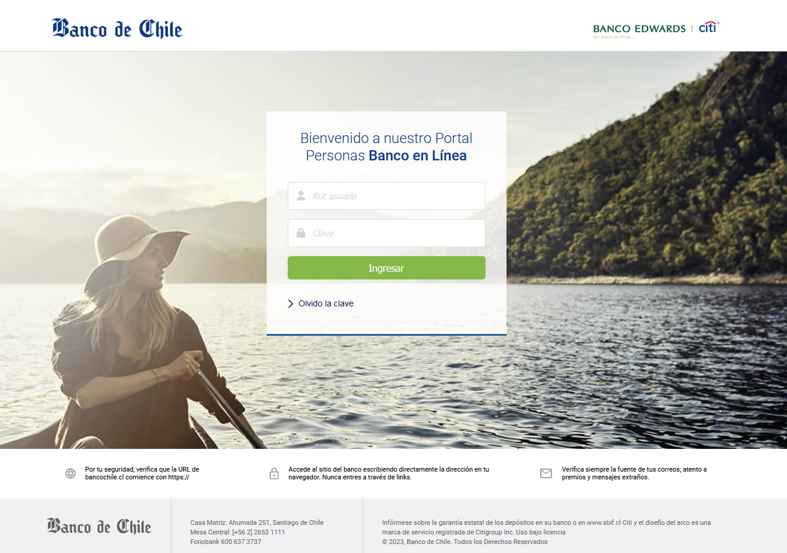
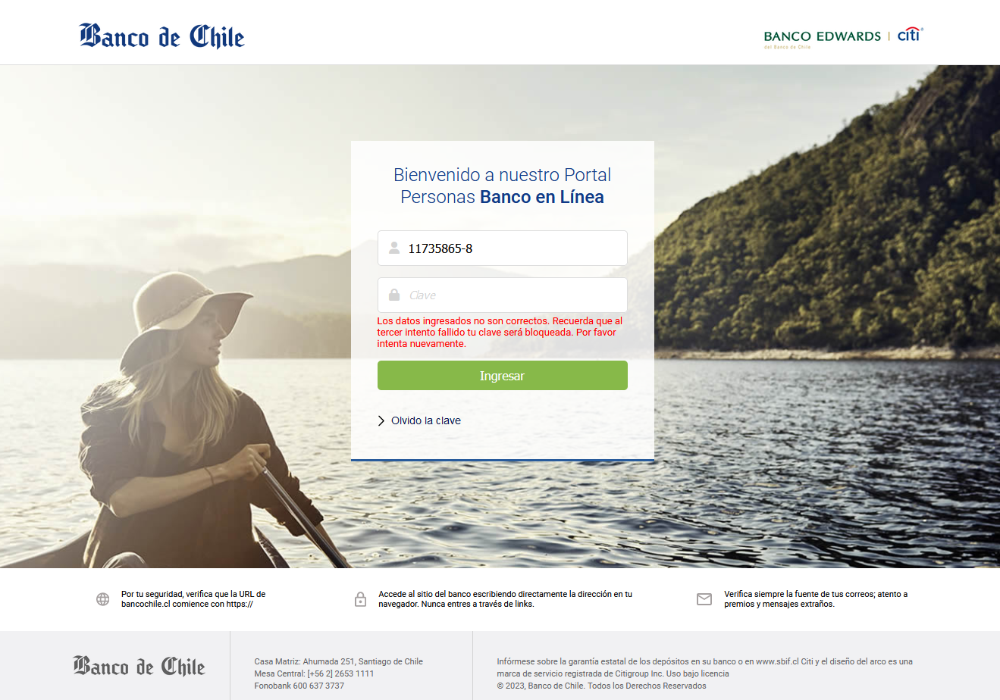
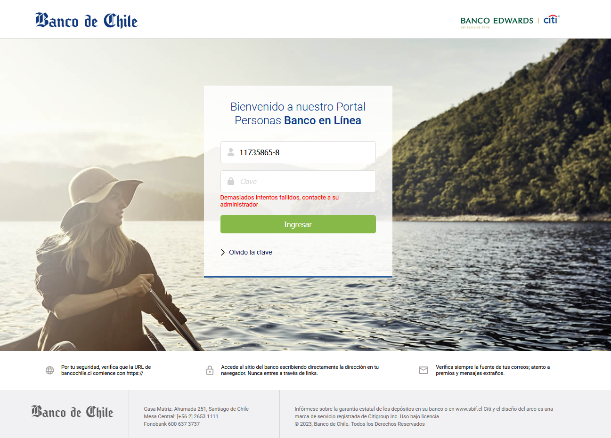
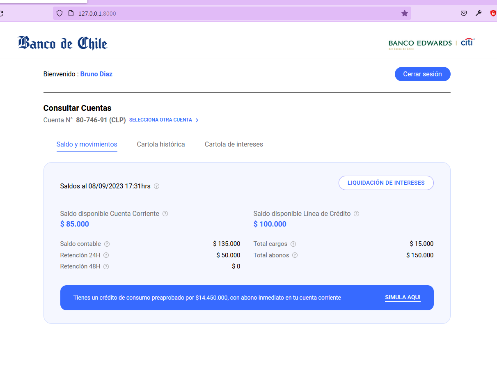
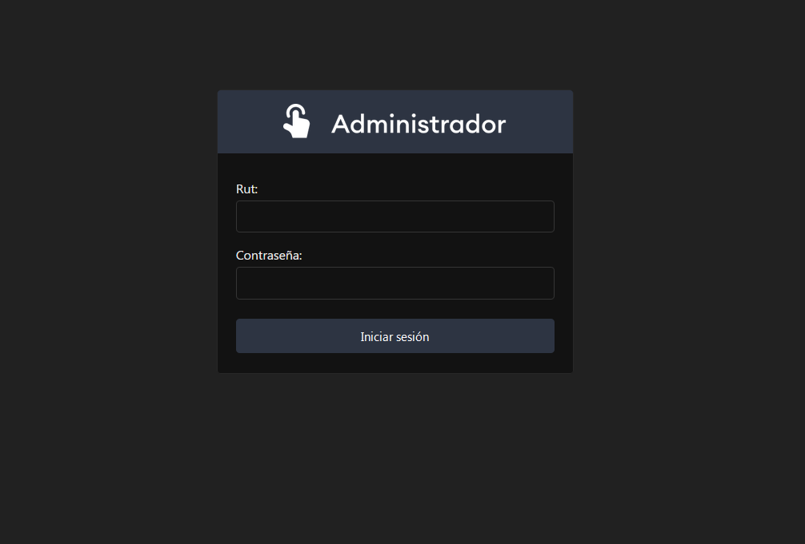
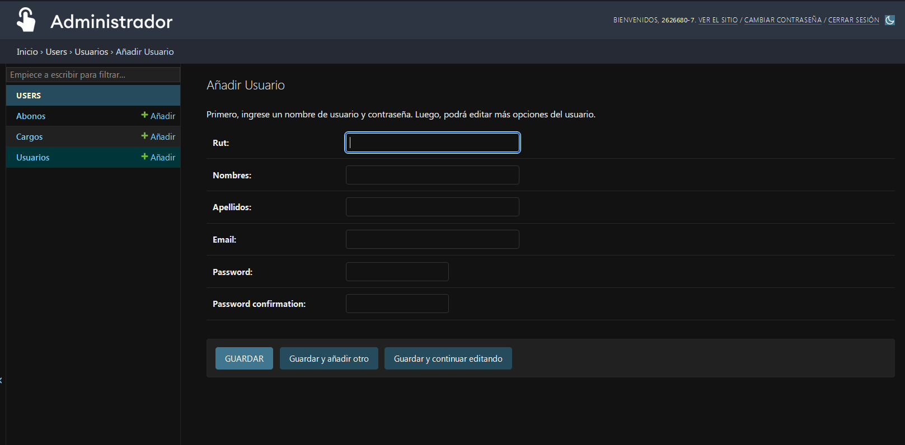
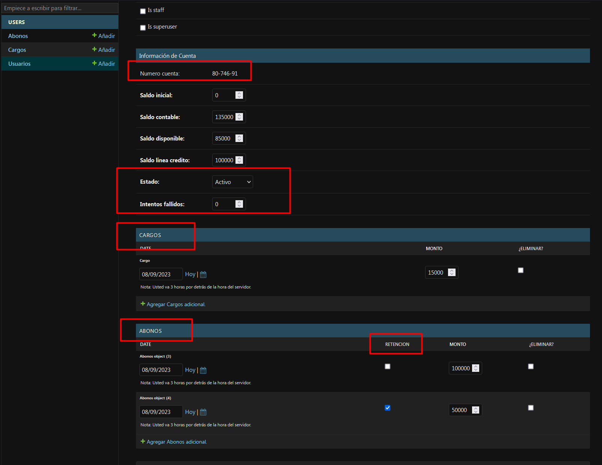

## Clone login Banco de Chile test AXIOMA 

```
python3 -m venv env
```
```
pip install -r req.txt
```
```
python manage.py runserver
```



## Funcionalidades:

- Valida rut chileno
- Valida credenciales 
- Solo 3 intentos fallidos luego se bloquea cliente
- Solo administrador puede desbloquear
- Login requerido para acceder a cartola
- Redirige al login si harcodea url un usuario no autorizado
- Cuenta con pagina administrador (django admin)
- El administrador crea cuentas de usuario
- El administrador crea cargos y abonos
- El saldo contable y disponible se actualiza segun cargos y abonos
- El comportamiento de saldos es real a un banco como retenciones y disponible
- El home de usuario tiene logout que redirige al login


## Tecnologías y librerías usadas:

- django
- django-crispy-forms
- sqlite3
- rut-chile
- css + sass
- js
- fontawesome icons






